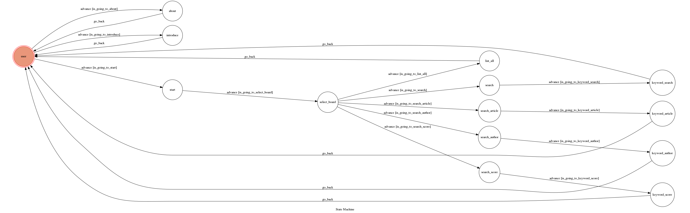

# PTT查詢小幫手

Chatbot of searching PTT for TOC Project 2019

A Facebook messenger bot based on a finite state machine

More details in the [Slides](https://hackmd.io/p/SkpBR-Yam#/) and [FAQ](https://hackmd.io/s/B1Xw7E8kN)

## Setup

### Prerequisite
* Python 3
* Facebook Page and App
* HTTPS Server

#### Install Dependency
```sh
pip3 install -r requirements.txt
```

* pygraphviz (For visualizing Finite State Machine)
    * [Setup pygraphviz on Ubuntu](http://www.jianshu.com/p/a3da7ecc5303)

#### Secret Data

`VERIFY_TOKEN` and `ACCESS_TOKEN` **MUST** be set to proper values.
Otherwise, you might not be able to run your code.

#### Run Locally
You can either setup https server or using `ngrok` as a proxy.

**`ngrok` would be used in the following instruction**

```sh
./ngrok http 5000
```

After that, `ngrok` would generate a https URL.

#### Run the sever

```sh
python3 app.py
```

## Finite State Machine


## Usage
The initial state is set to `user`.

Every time `user` state is triggered to `advance` to another state, it will `go_back` to `user` state after the bot replies corresponding message.

* `user`
	* Input: "about"
		* `about`
		* 顯示ChatBot簡介及URL按鈕
		* 顯示PTT圖片

	* Input: "intro"
		* `intro`
		* 顯示指令介紹
	
	* Input: "start"
		* `start`
		* 顯示PTT熱門看板
		* Input: 看板名稱 (須完全正確)
			* `select_board`
			* 已進入該看板，輸入以下搜尋指令
				* Input: "list all"
					* `list_all`
					* 直接列出第一頁所有文章資訊。
				* Input: "search"
					* `search`
					* Input: 關鍵字
						* `keyword_search`
						* 列出相符文章資訊。
				* Input: "search article"
					* `search_article`
					* Input: 文章標題 (須完全正確)
						* `keyword_article`
						* 列出相符文章資訊。
				* Input: "search author"
					* `search_author`
					* Input: 作者名稱
						* `keyword_author`
						* 列出相符文章資訊。
				* Input: "search score"
					* `search_score`
					* Input: 推/噓文數 ( 推文為+ / 噓文為- )
						* `keyword_score`
						* 列出推/噓文數大於輸入值的文章資訊。


## Reference
[TOC-Project-2017](https://github.com/Lee-W/TOC-Project-2017) ❤️ [@Lee-W](https://github.com/Lee-W)
